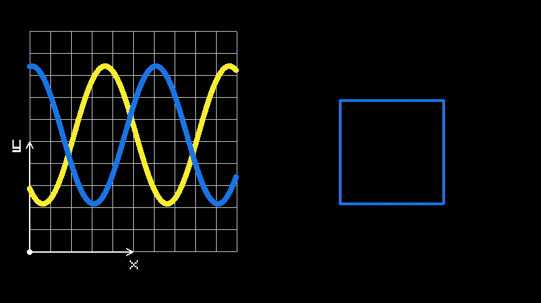

# CppAnimationFramework
A C++ animation framework to create visualisations of data and mathematical functions for use in videos and as a standalone interactive framework. 



## About

This framework is build upon [raylib](https://www.raylib.com/index.html) a cross platform videogaming library which supports a number of languages. 

## Installation

### Mac

#### Dependencies

The easiest way to get up and running on a Mac is to install [homebrew](https://brew.sh/) by navigating to this [webpage](https://brew.sh/) and following the instructions. Thereafter you can now run the following command in your terminal to install raylib.

```bash
brew install raylib
```

#### Installation

The installation requires CMake, you can install it [here](https://cmake.org/install/). Whereafter you can clone and create an executable from this repository.

```bash
git clone https://github.com/HarveyBates/CppAnimationFramework
cd CppAnimationFramework
cmake .
make
./bin/AnimationFramework
```

